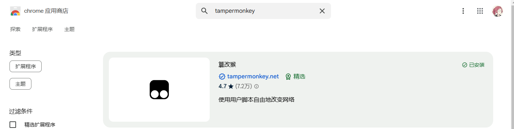
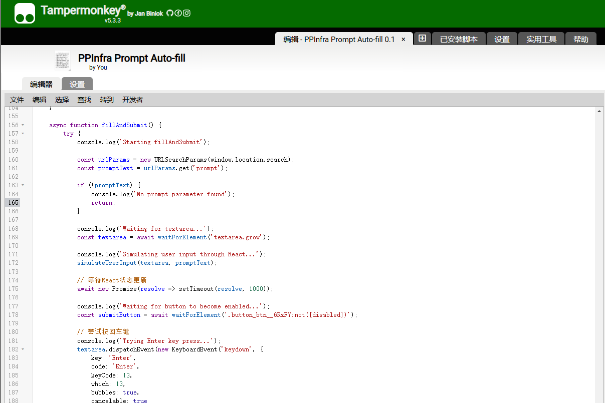
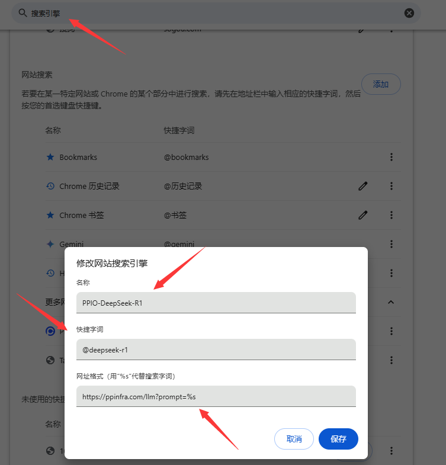
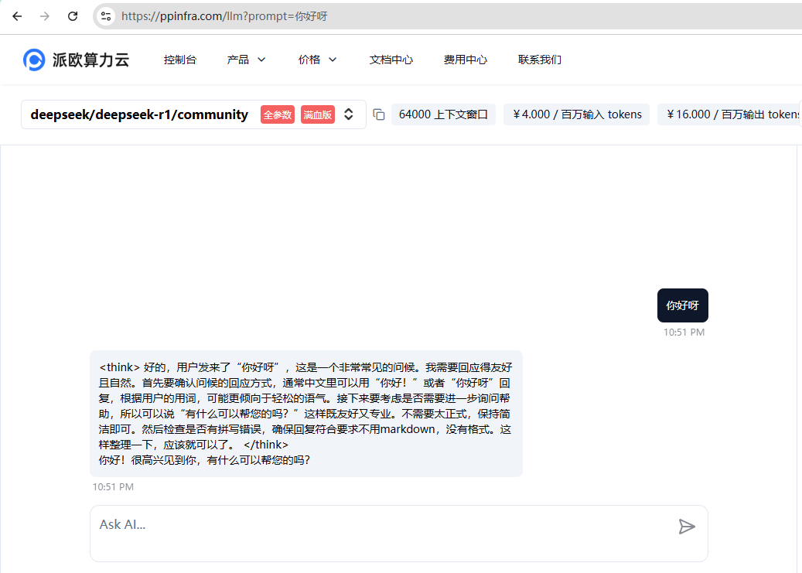

Combine DeepSeek with your browser
----------------------------------


## 如何使用


### 安装油猴

在 Chrome 应用商店搜索 tampermonkey, 点击安装插件



### 安装脚本

打开 tampermonkey 插件, 默认窗口就是添加脚本, 将这个脚本 [ppio.js](./PPIO/ppio.js) 的内容粘贴进去添加进去




### 设置搜索

打开 Chrome 设置, 搜索 "搜索引擎"

在 "网站搜索" 项目中点击右侧的 "添加"

然后按照图中的内容进行添加:

名称你方便记忆即可

快捷字词是搜索的前置关键词, 我这里设置的是@deepseek-r1, 这样只要在Chrome地址栏输入@deepseek-r1, 然后输入搜索内容, 就可以直接使用 DeepSeek-R1

网址格式填写 ```https://ppinfra.com/llm?prompt=%s```




点击保存

### 快去试试吧! 

在浏览器地址栏输入刚才预设的 @deepseek-r1


轻敲空格


然后输入你想搜索的内容, 就会自动使用 DeepSeek-R1 啦!




(这里的DeepSeek服务使用的是派欧云的，需要自己注册，当然你也可以使用自己的DeepSeek服务)


## Author

- [karminski](https://github.com/karminski)


## License

[MIT](./LICENSE)
